# Nested 공유주거 플랫폼 — ERD (schema.prisma 기준)

> 출처: `nested-mono/apps/api/prisma/schema.prisma` (2026-07-30 업데이트본)
> 구성: Core ERD / Community ERD
> 규모: 모델 35개 · Enum 33개

이 문서는 **실제 Prisma 스키마를 그대로 반영**합니다. cuid 문자열 PK, enum, self-relation, 1:1 옵셔널 관계 등 스키마의 실제 설계를 그대로 옮겼습니다.

## 이번 업데이트 반영 (2026-07-27 → 07-30)

- **예약 목록 숨김** — `Reservation.guestHiddenAt` / `legacyCompanionHiddenAt`, `ReservationCompanionMember.hiddenAt` 추가. 마이페이지 예약 관리 목록에서만 개인별로 숨김 처리(데이터는 유지).
- **다인실 개별 결제** — `ReservationCompanionMember.requiresIndividualPayment` 및 멤버별 금액(`monthlyRent`/`deposit`/… )·만료(`inviteExpiresAt`/`paymentDeadline`) 필드.
- **고객센터 문의** — `Inquiry` 모델 + `InquiryStatus`(RECEIVED/IN_PROGRESS/RESOLVED). 로그인 사용자 1:N, 운영팀 답변 시 알림.
- **친구 요청 워크플로우** — `FriendRequest` + `FriendRequestStatus`. 수락 시 `Friendship`으로 확정.
- **커뮤니티 소프트 삭제** — `Post.deletedAt`, `Comment.deletedAt`. 관리자 휴지통에서 복구.
- **평점 캐시** — `Room.avgRating`, `Room.reviewCount`(검색 목록 성능용, 원본은 `Review`).
- **쿠폰 연결** — `Reservation.couponId → Coupon`, `Coupon.ownerId → User` FK 정식 연결(이전 초안의 "고아 테이블" 서술은 더 이상 유효하지 않음).
- **알림 타입 확장** — `NotificationType`에 `INQUIRY_*`, `ROOM_UNPUBLISHED`, `FRIEND_REQUESTED`/`FRIEND_ADDED` 추가.

> ※ 활동 등급 세분화·성취 배지는 서비스 로직(계산 결과)이라 스키마에는 영향이 없어 ERD에는 나타나지 않습니다.

---

## 1. Core ERD (숙소·예약·결제·정산)

```mermaid
erDiagram
    USER ||--o{ ROOM : hosts
    USER ||--o{ PROPERTY : owns
    USER ||--o| HOST_PROFILE : has
    PROPERTY ||--o{ ROOM : contains
    ROOM ||--o{ IMAGE : has
    ROOM ||--o{ ROOM_AMENITY : has
    AMENITY ||--o{ ROOM_AMENITY : mapped_by
    ROOM ||--o{ CALENDAR_BLOCK : has
    ROOM ||--o{ RESERVATION : booked_in
    USER ||--o{ RESERVATION : "guest of"
    USER ||--o{ RESERVATION : "companion of (nullable)"
    RESERVATION ||--o{ RESERVATION_COMPANION_MEMBER : has
    USER ||--o{ RESERVATION_COMPANION_MEMBER : joins
    RESERVATION ||--o{ CONTRACT_CHANGE_REQUEST : has
    RESERVATION ||--o| PAYMENT : has
    RESERVATION ||--o| SETTLEMENT : has
    RESERVATION ||--o| TENANT_REVIEW : has
    COUPON ||--o{ RESERVATION : applied_to
    USER ||--o{ COUPON : owns
    ROOM ||--o{ REVIEW : has
    USER ||--o{ REVIEW : writes
    USER ||--o{ SETTLEMENT : receives
    USER ||--o{ WISHLIST : has
    WISHLIST ||--o{ FAVORITE : contains
    USER ||--o{ FAVORITE : saves
    ROOM ||--o{ FAVORITE : saved_as
    USER ||--o{ REFRESH_TOKEN : has
    USER ||--o{ PASSWORD_RESET_TOKEN : has
    USER ||--o{ EMAIL_VERIFICATION_TOKEN : has
    USER ||--o{ TENANT_REVIEW : "writes (author)"
    USER ||--o{ TENANT_REVIEW : "receives (tenant)"

    USER {
        string id PK "cuid"
        string email UK
        string passwordHash "nullable, OAuth-only는 null"
        string name "공개용 닉네임"
        boolean nicknameCompleted
        enum role "GUEST, HOST, ADMIN"
        string provider "nullable, google 등"
        string providerId "nullable"
        string avatarColor
        string avatarUrl "nullable, S3"
        string bio "nullable"
        datetime birthDate "nullable, 연령대·생일쿠폰"
        string job "nullable"
        boolean suspended "관리자 정지"
        datetime emailVerified "nullable, 미인증 시 로그인 차단"
        datetime verifiedAt "nullable, 관리자 신원확인"
        datetime deletedAt "nullable, 자진 탈퇴"
        datetime createdAt
        enum gender "MALE, FEMALE, OTHER"
        enum genderVisibility "PUBLIC, MATCHED_ONLY, PRIVATE"
        enum roommateGenderPreference "ANY, MALE, FEMALE"
        enum preferredLocale "KO, EN"
    }

    ROOM {
        string id PK "cuid"
        string hostId FK
        string propertyId FK "nullable, 독립 매물 가능"
        string name
        string region "레거시 호환"
        string city "nullable"
        string district "nullable"
        string neighborhood "nullable"
        string legalDongCode "nullable"
        string roadAddress "nullable, 비공개"
        string jibunAddress "nullable, 비공개"
        string detailAddress "nullable, 비공개"
        string zipCode "nullable"
        string address "nullable, 레거시"
        float lat
        float lng
        boolean verifiedByHost
        float avgRating "리뷰 집계 캐시"
        int reviewCount "리뷰 집계 캐시"
        enum roomType "레거시 분류, 자동계산"
        enum rentalUnit "nullable, WHOLE/PRIVATE_ROOM/BED"
        enum buildingType "nullable, STUDIO/APARTMENT/OFFICETEL/HOUSE"
        enum sharedFacilities "배열, 공유시설"
        boolean classificationReviewRequired "분류 검수 대상"
        int capacity "nullable, 최대 인원"
        int bedrooms "nullable"
        enum genderPolicy "ANY, MALE_ONLY, FEMALE_ONLY"
        int monthlyRent
        int deposit
        int cleaningFee
        int maintenanceFee
        int minStayMonths
        datetime availableFrom
        boolean petsAllowed
        boolean smokingAllowed
        boolean parking
        boolean published
        datetime createdAt
    }

    PROPERTY {
        string id PK "cuid"
        string hostId FK
        string title
        string address
        string region
        string city
        string zipCode "nullable"
        float lat
        float lng
        int builtYear "nullable"
        int floors "nullable"
        datetime createdAt
    }

    HOST_PROFILE {
        string id PK "cuid"
        string userId FK,UK "1:1"
        string bio "nullable"
        boolean superhost
        int responseRate
        string payoutBank "nullable"
        string payoutAccount "nullable"
        datetime createdAt
    }

    IMAGE {
        string id PK "cuid"
        string roomId FK
        string url
        int order
    }

    AMENITY {
        string id PK "cuid"
        string key UK "wifi, parking 등"
        string label
        string icon "nullable"
    }

    ROOM_AMENITY {
        string roomId PK,FK
        string amenityId PK,FK
    }

    CALENDAR_BLOCK {
        string id PK "cuid"
        string roomId FK
        datetime date
        boolean blocked
        string reason "nullable"
    }

    RESERVATION {
        string id PK "cuid"
        string roomId FK
        string guestId FK "대표 예약자"
        string companionId FK "nullable, 레거시 단일 초대"
        enum companionStatus "nullable"
        datetime companionRespondedAt "nullable"
        datetime checkIn
        datetime checkOut
        datetime originalCheckOut "nullable, 최초 종료일 보존"
        datetime actualCheckOut "nullable, 실제 퇴실일"
        datetime guestHiddenAt "nullable, 게스트 목록 숨김"
        datetime legacyCompanionHiddenAt "nullable, 레거시 초대 숨김"
        int months
        enum status "PENDING_PAYMENT, CONFIRMED, …"
        enum bookingMode "UNIT, BED, WHOLE_ROOM"
        int reservedSpots
        int monthlyRent
        int deposit
        int cleaningFee
        int maintenanceFee
        int serviceFee
        int discount
        int totalDueNow
        string couponId FK "nullable"
        int extensionMonths "nullable, 연장 대기"
        datetime createdAt
    }

    RESERVATION_COMPANION_MEMBER {
        string id PK "cuid"
        string reservationId FK
        string userId FK
        enum status "PENDING, ACCEPTED, …"
        datetime respondedAt "nullable"
        boolean requiresIndividualPayment "개별 결제 여부"
        datetime inviteExpiresAt "nullable"
        datetime paymentDeadline "nullable"
        datetime paidAt "nullable"
        datetime expiredAt "nullable"
        datetime hiddenAt "nullable, 목록 숨김"
        int monthlyRent "멤버별 1자리 금액"
        int deposit
        int cleaningFee
        int maintenanceFee
        int serviceFee
        int discount
        int totalDueNow
        string paymentProvider "nullable"
        string paymentTxnId "nullable"
        datetime createdAt
    }

    CONTRACT_CHANGE_REQUEST {
        string id PK "cuid"
        string reservationId FK
        string requesterId
        enum type "EARLY_CHECKOUT, EXTENSION"
        enum status "HOST_REVIEW, PAYMENT_PENDING, …"
        datetime originalCheckOut
        datetime requestedCheckOut
        int additionalRent
        int additionalMaintenance
        int additionalServiceFee
        int additionalAmount
        int estimatedRefund
        int depositDeduction
        int finalRefund "nullable"
        string rejectReason "nullable"
        string paymentProvider "nullable"
        string paymentTxnId "nullable"
        datetime paymentDeadline "nullable"
        datetime reviewedAt "nullable"
        datetime paidAt "nullable"
        datetime appliedAt "nullable"
        datetime actualCheckOut "nullable"
        datetime createdAt
        datetime updatedAt
    }

    PAYMENT {
        string id PK "cuid"
        string reservationId FK,UK "1:1"
        string provider "TOSS, PORTONE, STRIPE"
        string providerTxnId
        int amount
        enum status "PENDING, PAID, REFUNDED, FAILED"
        datetime createdAt
    }

    SETTLEMENT {
        string id PK "cuid"
        string reservationId FK,UK "1:1"
        string hostId FK
        int grossAmount
        int commission
        int netAmount
        enum status "SCHEDULED, PAID, ON_HOLD"
        datetime scheduledFor
        datetime paidAt "nullable"
        datetime createdAt
    }

    COUPON {
        string id PK "cuid"
        string code UK
        string type "FIXED | PERCENT"
        int value
        int maxDiscount "nullable"
        int minSpend "첫 달 월세 기준"
        datetime validFrom
        datetime validTo
        int usageLimit "nullable"
        int usedCount
        string kind "GENERAL | BIRTHDAY"
        string ownerId FK "nullable, 생일 쿠폰 소유자"
    }

    REVIEW {
        string id PK "cuid"
        string roomId FK
        string authorId FK
        int rating
        string body
        string hostReply "nullable"
        datetime createdAt
    }

    TENANT_REVIEW {
        string id PK "cuid"
        string reservationId FK,UK "1:1"
        string authorId FK "호스트"
        string tenantId FK "입주자"
        int rating
        string body
        datetime createdAt
    }

    WISHLIST {
        string id PK "cuid"
        string userId FK
        string name
        datetime createdAt
    }

    FAVORITE {
        string id PK "cuid"
        string userId FK
        string roomId FK
        string wishlistId FK "nullable"
        datetime createdAt
    }

    REFRESH_TOKEN {
        string id PK "cuid"
        string userId FK
        string tokenHash "해시만 저장"
        datetime expiresAt
        datetime createdAt
    }

    PASSWORD_RESET_TOKEN {
        string id PK "cuid"
        string userId FK
        string tokenHash UK "해시만 저장"
        datetime expiresAt
        datetime usedAt "nullable, 재사용 방지"
        datetime createdAt
    }

    EMAIL_VERIFICATION_TOKEN {
        string id PK "cuid"
        string userId FK
        string tokenHash UK "해시만 저장"
        datetime expiresAt
        datetime usedAt "nullable, 재사용 방지"
        datetime createdAt
    }
```

### Core ERD — 스키마에서 확인한 설계 의도

- `Room.propertyId`는 nullable — 독립 매물(Property 없이 등록된 Room)이 있을 수 있음.
- 숙소 분류가 2원화되어 공존 — 레거시 `roomType`과 신규 3축(`rentalUnit`/`buildingType`/`sharedFacilities`). 신규 필드는 nullable로 시작하며, 애매한 건은 `classificationReviewRequired`로 검수 대상 표시.
- `Room.avgRating`·`reviewCount`는 `Review` 집계 캐시 — 검색 목록에서 매번 집계하지 않도록 리뷰 생성 시 미리 계산. 원본 데이터는 여전히 `Review` 테이블(`reviews.module.ts`의 `create()`가 갱신 책임).
- `Reservation`은 공동 예약(룸메이트) 지원 — 대표자(`guest`) 외에 레거시 단일 초대(`companionId` + `CompanionStatus`)와 신규 다인실 초대(`ReservationCompanionMember`)가 공존. `requiresIndividualPayment=true`인 멤버만 개별 결제·자동 만료 흐름을 사용.
- 예약 목록 숨김은 3곳에 분리 — 게스트는 `Reservation.guestHiddenAt`, 레거시 초대는 `legacyCompanionHiddenAt`, 다인실 초대 멤버는 `ReservationCompanionMember.hiddenAt`. 숨김은 목록 표시용일 뿐 데이터는 보존.
- 조기 퇴실·연장은 `ContractChangeRequest`로 관리 — 상태 머신(`HOST_REVIEW → PAYMENT_PENDING → APPROVED …`)과 정산 금액을 함께 보관.
- `Payment`·`Settlement`은 예약과 1:1. `Settlement`은 호스트 정산(수수료·순액·정산 예정일).
- `Coupon`은 `Reservation.couponId`(SetNull)와 `Coupon.ownerId`(생일 쿠폰 소유자)로 정식 연결 — 할인은 첫 달 월세에만 적용되고 결제 확정 시 사용 처리.
- `TenantReview`는 호스트 → 입주자 역방향 평가로, 게스트 → 숙소인 `Review`와 방향이 반대. 예약 1건당 1개.
- 인증·세션 토큰(`RefreshToken`/`PasswordResetToken`/`EmailVerificationToken`)은 해시만 저장 — 유출 시에도 원본 토큰 복원 불가.

---

## 2. Community ERD (게시판·채팅·DM·룸메이트 매칭·문의·알림)

```mermaid
erDiagram
    USER ||--o{ POST : writes
    USER ||--o{ COMMENT : writes
    ROOM ||--o{ POST : hosts_board
    POST ||--o{ COMMENT : has
    COMMENT ||--o{ COMMENT : replies
    ROOM ||--o{ CHAT_ROOM : about
    USER ||--o{ CHAT_ROOM : "guest of"
    USER ||--o{ CHAT_ROOM : "host of"
    CHAT_ROOM ||--o{ MESSAGE : has
    USER ||--o{ MESSAGE : sends
    USER ||--o{ FRIEND_REQUEST : "sends (requester)"
    USER ||--o{ FRIEND_REQUEST : "receives (receiver)"
    USER ||--o{ FRIENDSHIP : "user A"
    USER ||--o{ FRIENDSHIP : "user B"
    USER ||--o{ DIRECT_CONVERSATION : "participant A"
    USER ||--o{ DIRECT_CONVERSATION : "participant B"
    DIRECT_CONVERSATION ||--o{ DIRECT_MESSAGE : has
    USER ||--o{ DIRECT_MESSAGE : sends
    USER ||--o| ROOMMATE_PREFERENCE : has
    USER ||--o{ NOTIFICATION : receives
    USER ||--o{ INQUIRY : writes
    USER ||--o{ REPORT : "files (reporter)"
    USER ||--o{ REPORT : "reported (nullable)"

    USER {
        string id PK "cuid"
        string email UK
        string name "공개용 닉네임"
        enum role "GUEST, HOST, ADMIN"
        string avatarUrl "nullable"
        enum gender "MALE, FEMALE, OTHER"
        enum genderVisibility "PUBLIC, MATCHED_ONLY, PRIVATE"
        enum roommateGenderPreference "ANY, MALE, FEMALE"
    }

    POST {
        string id PK "cuid"
        string roomId FK "하우스 게시판"
        string authorId FK
        enum category "NOTICE, EVENT, CHORE, MARKET, CHAT, SEEKING"
        enum status "OPEN, IN_PROGRESS, COMPLETED, CLOSED"
        string title
        string body
        boolean pinned
        json lifestyleSnapshot "nullable"
        string sharedLifestyleFields "배열"
        datetime deletedAt "nullable, 소프트 삭제"
        datetime createdAt
        datetime updatedAt
    }

    COMMENT {
        string id PK "cuid"
        string postId FK
        string authorId FK
        string parentId FK "nullable, 대댓글 자기참조"
        string body
        datetime deletedAt "nullable, 소프트 삭제"
        datetime createdAt
        datetime updatedAt
    }

    CHAT_ROOM {
        string id PK "cuid"
        string roomId FK
        string guestId FK
        string hostId FK
        string hiddenBy "배열, 개인별 숨김"
        datetime createdAt
    }

    MESSAGE {
        string id PK "cuid"
        string chatRoomId FK
        string senderId FK
        string body "nullable"
        string imageUrl "nullable, S3"
        string readBy "배열"
        datetime createdAt
    }

    FRIEND_REQUEST {
        string id PK "cuid"
        string pairKey UK "중복 방지"
        string requesterId FK
        string receiverId FK
        enum status "PENDING, ACCEPTED, REJECTED"
        datetime createdAt
        datetime updatedAt
        datetime respondedAt "nullable"
    }

    FRIENDSHIP {
        string id PK "cuid"
        string userAId FK "정렬 저장"
        string userBId FK "정렬 저장"
        datetime createdAt
    }

    DIRECT_CONVERSATION {
        string id PK "cuid"
        string participantAId FK "정렬 저장"
        string participantBId FK "정렬 저장"
        string hiddenBy "배열, 개인별 숨김"
        datetime createdAt
        datetime updatedAt
    }

    DIRECT_MESSAGE {
        string id PK "cuid"
        string conversationId FK
        string senderId FK
        string body "nullable"
        string imageUrl "nullable"
        string readBy "배열"
        datetime createdAt
    }

    ROOMMATE_PREFERENCE {
        string id PK "cuid"
        string userId FK,UK "1:1"
        enum noise "QUIET, MODERATE, LIVELY"
        enum cleanliness "VERY_TIDY, MODERATE, RELAXED"
        enum smoking "NON_SMOKING_ONLY, OUTDOOR_OK, SMOKING_OK"
        enum pets "NO_PETS, CONDITIONAL, PETS_OK"
        enum visitors "PRIOR_AGREEMENT, OCCASIONAL_OK, FREQUENT_OK"
        enum sleep "EARLY_BIRD, FLEXIBLE, NIGHT_OWL"
        enum sociability "PRIVATE, BALANCED, SOCIAL"
        enum sharedSpace "MINIMAL, MODERATE, COMMUNAL"
        enum drinking "NON_DRINKER, SOCIAL_DRINKER, FREQUENT"
        string intro "nullable, 주관식"
        string keywords "배열, 규칙 기반 추출"
        boolean isCompleted "match 진입 게이트"
        datetime createdAt
        datetime updatedAt
    }

    NOTIFICATION {
        string id PK "cuid"
        string userId FK
        enum type "INQUIRY_*, FRIEND_*, RESERVATION_*, …"
        string title
        string body
        boolean read
        datetime createdAt
        string targetUrl "nullable"
    }

    INQUIRY {
        string id PK "cuid"
        string authorId FK
        string title
        string body
        enum status "RECEIVED, IN_PROGRESS, RESOLVED"
        string answer "nullable, 운영팀 답변"
        datetime answeredAt "nullable"
        string answeredBy "nullable"
        datetime createdAt
        datetime updatedAt
    }

    REPORT {
        string id PK "cuid"
        string reporterId FK
        string reportedUserId FK "nullable, 피신고자"
        enum targetType "ROOM, REVIEW, USER, MESSAGE, COMMUNITY_POST, COMMUNITY_COMMENT"
        string targetId
        string reason
        enum status "RECEIVED, IN_REVIEW, RESOLVED"
        datetime reporterNotifiedAt "nullable"
        datetime reportedNotifiedAt "nullable"
        datetime resolvedNotifiedAt "nullable"
        datetime resolvedAt "nullable"
        datetime createdAt
    }

    NOTICE {
        string id PK "cuid"
        string title
        string body
        boolean pinned
        datetime createdAt
        datetime updatedAt
    }

    BANNER {
        string id PK "cuid"
        string title
        string color "hex"
        string position "노출 위치"
        string linkUrl "nullable"
        string imageUrl "nullable"
        boolean active "홈 노출 필터"
        int order
        datetime createdAt
        datetime updatedAt
    }
```

### Community ERD — 설계 포인트

- `Post.roomId`는 "이 숙소(하우스)의 게시판"을 의미 — 입주자 커뮤니티 게시판 구조. `Comment`는 `parentId` 자기참조로 대댓글(1단계)까지 지원.
- `Post`·`Comment`에 `deletedAt` 소프트 삭제 — 관리자가 지워도 데이터는 남고, 휴지통(`/admin/trash`)에서 복구.
- 친구 관계가 2단계로 분리 — `FriendRequest`(요청 워크플로우, PENDING/ACCEPTED/REJECTED, `pairKey` 유니크로 중복 방지)를 수락하면 `Friendship`(`userAId`/`userBId` 정렬 저장)으로 확정.
- `DirectConversation`·`DirectMessage`는 사용자 간 1:1 DM — 참가자를 `participantA`/`B`로 정렬 저장(중복 방지)하고 `hiddenBy`로 개인별 숨김 처리.
- `RoommatePreference`는 User와 1:1(`@unique`) — 9개 성향 답변 + 주관식(`intro`) → 규칙 기반 `keywords` 추출. `isCompleted`가 `/match` 진입 게이트.
- `Inquiry`(고객센터 문의) — 로그인 사용자 1:N. 운영팀이 답변을 남기면 `InquiryStatus`가 RESOLVED로 바뀌고 작성자에게 `INQUIRY_ANSWERED` 알림.
- `Report`는 대상 6종(ROOM/REVIEW/USER/MESSAGE/COMMUNITY_POST/COMMUNITY_COMMENT)을 다루며, 피신고자(`reportedUserId`)와 알림 타임스탬프를 함께 보관.
- `NotificationType`에 `INQUIRY_*`·`ROOM_UNPUBLISHED`·`FRIEND_REQUESTED`/`ADDED`가 추가. 레거시 `MESSAGE`·`RESERVATION` 값은 기존 데이터 호환용으로 유지.
- `Notice`·`Banner`는 사용자 관계가 없는 서비스 콘텐츠 — 관리자만 관리하며 홈/공지 페이지에 노출.

---

## 도메인 경계 참고

**Core (21)** User, Room, Property, HostProfile, Image, Amenity, RoomAmenity, CalendarBlock, Reservation, ReservationCompanionMember, ContractChangeRequest, Payment, Settlement, Coupon, Review, TenantReview, Wishlist, Favorite, RefreshToken, PasswordResetToken, EmailVerificationToken

**Community (15)** User, Post, Comment, ChatRoom, Message, FriendRequest, Friendship, DirectConversation, DirectMessage, RoommatePreference, Notification, Report, Inquiry, Notice, Banner

> ※ User는 두 도메인의 중심 허브라 양쪽 다이어그램에 모두 표시됩니다. 총 모델 35개 = Core 21 + Community 15 − User 중복 1.
