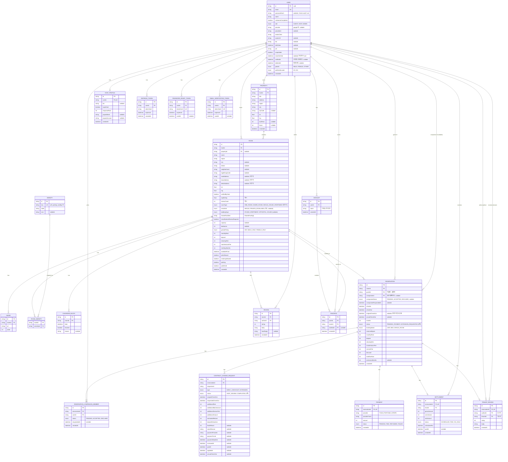
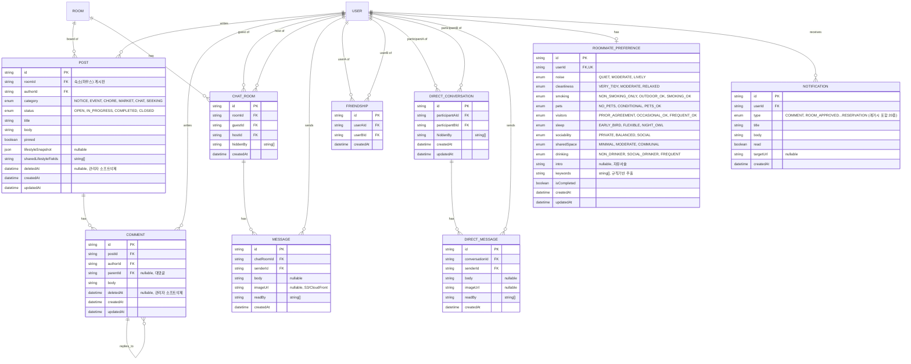
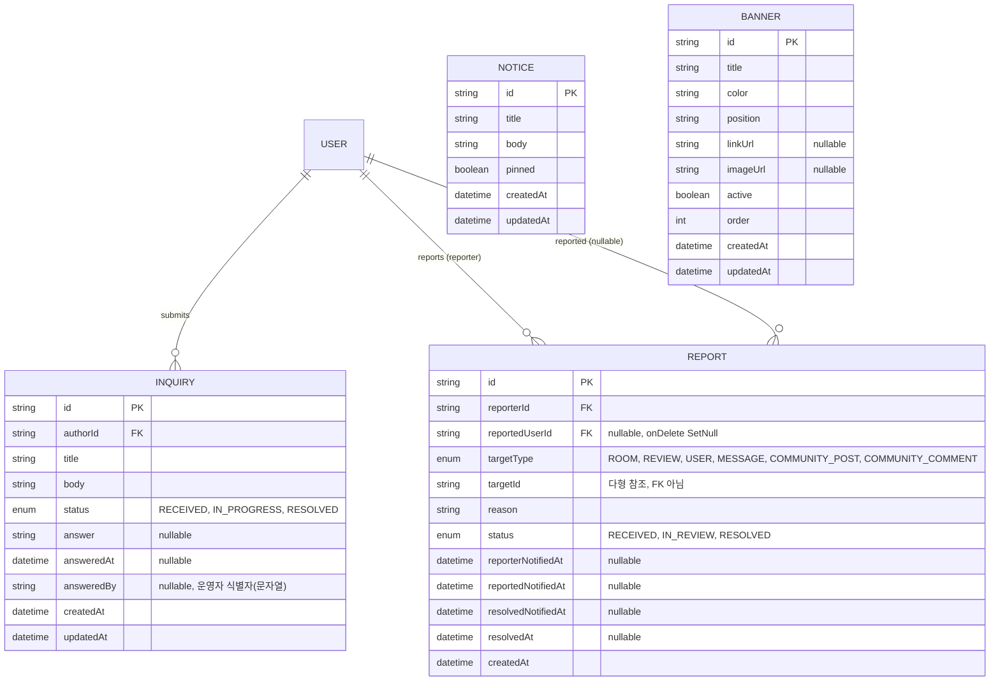

# Nested 공유주거 플랫폼 — ERD (schema.prisma 기준)

> 출처: `nested-mono/apps/api/prisma/schema.prisma` (2026-07-27 업로드본)
> 구성: Core ERD / Community ERD / Ops·Admin ERD

이전 버전은 도메인 추정으로 그린 초안이었고, 이 문서는 **실제 Prisma 스키마를 그대로 반영**합니다. cuid 문자열 PK, enum, self-relation, 1:1 옵셔널 관계 등 스키마의 실제 설계를 그대로 옮겼습니다.

---

## 1. Core ERD (숙소·예약·결제·정산)

**스키마에서 확인한 설계 의도 (코드 주석 기준)**
- `Room.propertyId`는 nullable — 독립 매물(Property 없이 등록된 Room)이 있을 수 있음.
- `roomType`(레거시) vs `rentalUnit`/`buildingType`(신규 3축 분류)이 공존 — 마이그레이션 중인 상태로 보임, 신규 필드는 nullable.
- `Reservation`은 `companionId`로 공동 예약(룸메이트) 지원 — 대표자가 결제, 동반자는 별도 동의(`CompanionStatus`) 필요.
- `Reservation.originalCheckOut` / `actualCheckOut`을 별도로 둬서 연장·조기퇴실 이력과 실제 값을 구분.
- `Payment`, `Settlement`, `TenantReview`는 모두 `Reservation`과 1:1(`@unique`) — 예약 1건당 각각 최대 1개.

⚠️ **`Coupon` 모델은 스키마에 존재하지만 다른 모델과 FK로 연결되어 있지 않습니다.** `Reservation.discount` 필드는 있는데 `couponId` 참조가 없어, 실제로는 사용되지 않거나 애플리케이션 레이어에서만 처리되는 것으로 보입니다 — 이전 초안 ERD에서 `RESERVATION }o--o| COUPON`으로 그렸던 관계는 실제 스키마에는 없습니다.

---

## 2. Community ERD

**설계 포인트**
- `Post.roomId`는 "이 숙소(하우스)의 게시판"을 의미 — 입주자 커뮤니티 게시판 구조. `Comment`는 "💬 N replies" UI에 대응.
- `Friendship`, `DirectConversation`은 코드 주석상 `userAId/userBId`를 **정렬해서 저장** — 중복 관계 방지용 관례.
- `ROOMMATE_PREFERENCE`는 User와 1:1(`@unique`) — 온보딩 설문, `/match` 알고리즘 진입 조건은 `isCompleted`.
- `NotificationType`에 `MESSAGE`, `RESERVATION` 같은 "기존 알림 데이터 호환용" enum 값이 스키마 주석에 명시되어 있음 — 레거시 데이터 마이그레이션 흔적.

---

## 3. Ops·Admin ERD

**설계 포인트**
- `Report.targetType` + `targetId`로 다형 참조(polymorphic) — ROOM/REVIEW/USER/MESSAGE/게시글/댓글을 하나의 신고 테이블로 통합. `targetId`는 실제 FK 제약이 없는 문자열입니다.
- `Report.answeredBy`(Inquiry)는 관리자 테이블과 FK로 연결돼 있지 않고 **문자열**로만 저장 — 별도 `Admin` 모델이 스키마에 없고, `User.role = ADMIN`으로 관리자를 구분하는 구조입니다. 앞서 초안에서 그렸던 `ADMIN_ROLE`/`PERMISSION` RBAC 테이블은 실제 스키마에는 없습니다.
- `Notice`, `Banner`는 특정 유저와 관계없는 서비스 단위 콘텐츠 — FK 없음.

---

## 이전 초안과의 주요 차이

| 항목 | 이전 초안(추정) | 실제 스키마 |
|---|---|---|
| PK 타입 | bigint auto-increment | `String @id @default(cuid())` |
| 관리자 권한 | ADMIN_ROLE/PERMISSION RBAC | `User.role` enum(GUEST/HOST/ADMIN)만 존재, 별도 Admin 테이블 없음 |
| 쿠폰 | Reservation과 FK 연결 | 스키마상 고아 테이블(연결 없음) |
| 커뮤니티 | 플랫폼 전역 게시판 | `Room`(하우스) 단위 게시판 |
| 예약 | 개인 예약만 | 공동 예약(companion), 계약변경(연장/조기퇴실) 지원 |
| 채팅 | 없음 | 숙소 문의용 `ChatRoom` + 별도 `DirectConversation`(1:1 DM) 이원화 |
| 추가 도메인 | — | 룸메이트 매칭 설문(`RoommatePreference`), 입주자 평가(`TenantReview`), 정산(`Settlement`) |

---

## README 최신화 관련 메모

레포 README에는 백엔드 배포처가 **Railway**로 적혀 있는데, 실제로는 **Render**를 쓰고 계신 것으로 보입니다 (공유해주신 Render 대시보드 링크 기준). README 업데이트 시 이 부분도 함께 고치는 걸 권장드립니다. 원하시면 README 원문을 가져와서 배포 섹션만 정정해드릴 수 있어요.
